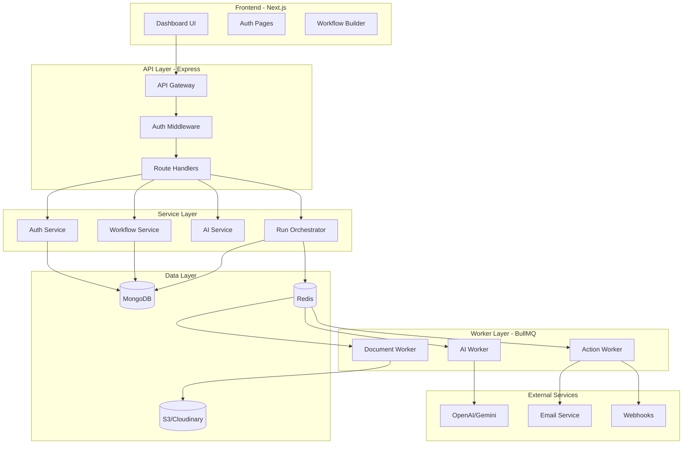
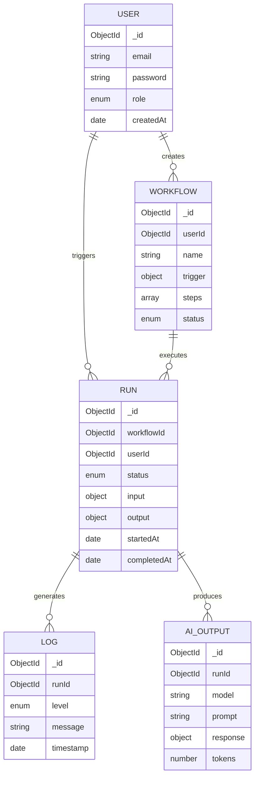
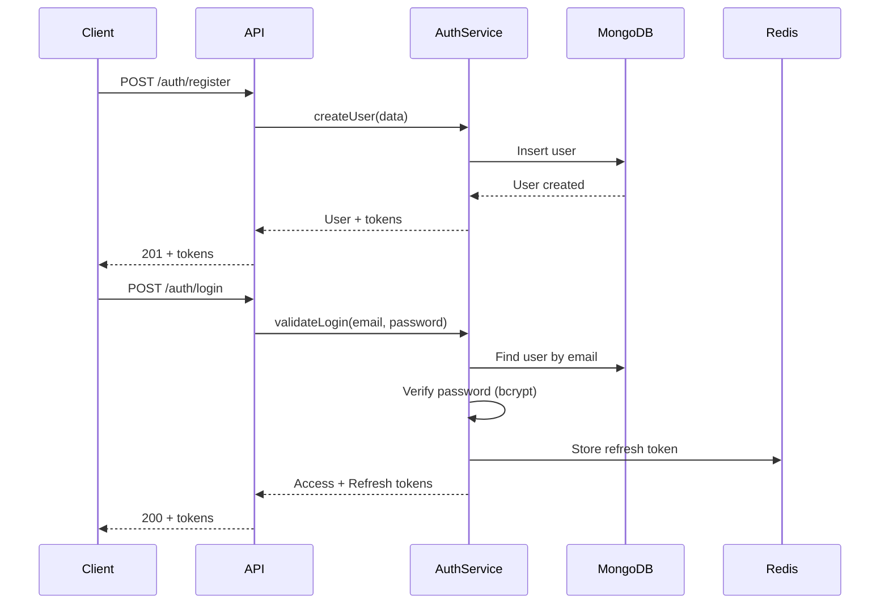
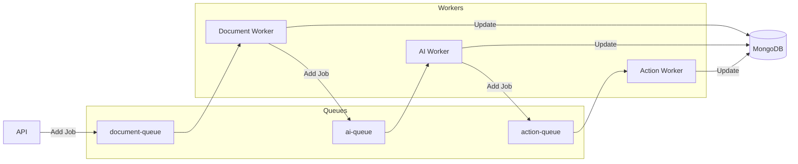

# AutoFlow AI - Implementation Plan

## Overview

AutoFlow AI is a full-stack GenAI-powered automation platform that enables users to upload documents, process them with AI, and execute automated workflows. This plan outlines the complete architecture, folder structure, and implementation approach.



---

## Project Structure

We use a **pnpm monorepo** for clean separation between frontend, backend, and shared types:

```
autoflow-ai/
├── apps/
│   ├── api/                      # Backend Express API
│   │   ├── src/
│   │   │   ├── config/           # Environment & app configuration
│   │   │   ├── controllers/      # Route controllers (thin layer)
│   │   │   ├── middleware/       # Auth, validation, error handling
│   │   │   ├── models/           # Mongoose schemas
│   │   │   ├── routes/           # Express route definitions
│   │   │   ├── services/         # Business logic layer
│   │   │   │   ├── auth/         # Auth service
│   │   │   │   ├── ai/           # AI provider abstraction
│   │   │   │   ├── workflow/     # Workflow service
│   │   │   │   ├── run/          # Run orchestrator
│   │   │   │   └── file/         # File handling service
│   │   │   ├── workers/          # BullMQ workers
│   │   │   │   ├── document.worker.ts
│   │   │   │   ├── ai.worker.ts
│   │   │   │   └── action.worker.ts
│   │   │   ├── queues/           # Queue definitions
│   │   │   ├── utils/            # Helpers, logger, etc.
│   │   │   ├── types/            # TypeScript types
│   │   │   └── app.ts            # Express app setup
│   │   ├── tests/
│   │   ├── tsconfig.json
│   │   └── package.json
│   │
│   └── web/                      # Frontend Next.js App
│       ├── src/
│       │   ├── app/              # Next.js App Router
│       │   │   ├── (auth)/       # Auth route group
│       │   │   ├── (dashboard)/  # Dashboard route group
│       │   │   ├── api/          # API routes (optional)
│       │   │   └── layout.tsx
│       │   ├── components/       # React components
│       │   │   ├── ui/           # Base UI components
│       │   │   ├── forms/        # Form components
│       │   │   └── features/     # Feature-specific components
│       │   ├── hooks/            # Custom React hooks
│       │   ├── lib/              # Utilities, API client
│       │   ├── providers/        # Context providers
│       │   ├── stores/           # State management (if needed)
│       │   └── types/            # Frontend-specific types
│       ├── public/
│       ├── tailwind.config.ts
│       └── package.json
│
├── packages/
│   └── shared/                   # Shared types & utilities
│       ├── src/
│       │   ├── types/            # Shared TypeScript interfaces
│       │   └── constants/        # Shared constants
│       └── package.json
│
├── docker-compose.yml            # Local dev environment
├── pnpm-workspace.yaml
├── package.json
└── README.md
```

---

## Data Models

### Entity Relationship Diagram



### Core Models

| Model | Purpose | Key Fields |
|-------|---------|------------|
| **User** | Authentication & authorization | email, password, role, refreshTokens |
| **Workflow** | Workflow definitions | name, trigger, steps[], userId, status |
| **Run** | Execution instances | workflowId, status, input, output, logs, timestamps |
| **Log** | Audit & debugging | runId, level, message, metadata, timestamp |
| **AIOutput** | AI response storage | runId, prompt, response, tokens, latency, model |

---

## Authentication Flow



---

## Worker System



### Queue Configuration

| Queue | Purpose | Concurrency | Retry |
|-------|---------|-------------|-------|
| document-processing | PDF parsing, text extraction | 3 | 3 attempts |
| ai-processing | AI completions, structured outputs | 5 | 3 attempts with backoff |
| action-execution | Emails, webhooks, data saves | 10 | 5 attempts |

---

## AI Service Layer

### Provider Abstraction

```typescript
interface AIProvider {
  complete(prompt: string, options: AIOptions): Promise<AIResponse>;
  completeWithSchema<T>(prompt: string, schema: JSONSchema): Promise<T>;
}
```

### Features
- Automatic retry with exponential backoff
- Response validation against JSON schema
- Token counting and cost tracking
- Request/response logging
- Rate limit handling

### Prompt Template System

```typescript
const templates = {
  extractData: {
    system: "You are a data extraction assistant...",
    user: "Extract the following from this text: {{fields}}",
    schema: extractionSchema
  }
};
```

---

## Technology Choices

| Component | Technology | Rationale |
|-----------|------------|-----------|
| **Monorepo** | pnpm workspaces | Fast, efficient disk usage, good workspace support |
| **Backend** | Express + TypeScript | Mature, well-documented, extensive middleware ecosystem |
| **Database** | MongoDB + Mongoose | Flexible schema for workflow definitions, good with JSON |
| **Queue** | BullMQ + Redis | Production-tested, excellent job management features |
| **AI** | OpenAI/Gemini SDK | Best structured output support, reliable APIs |
| **Frontend** | Next.js 14 App Router | Modern React patterns, excellent DX, built-in optimization |
| **Styling** | Tailwind CSS | Rapid UI development, consistent design system |
| **Data Fetching** | TanStack Query | Best-in-class caching, mutations, and sync |
| **Logging** | Pino | Fastest Node.js logger, structured JSON output |

---

## Development Phases

### Phase 1: Project Scaffolding
- Monorepo setup with pnpm workspaces
- Backend/frontend initialization
- Shared types package
- Development tooling (ESLint, Prettier)

### Phase 2: Backend Infrastructure
- Express server with TypeScript
- MongoDB/Redis connections
- BullMQ queue setup
- Logging and error handling

### Phase 3: Authentication
- User model with password hashing
- JWT token management
- Auth middleware and RBAC
- Rate limiting

### Phase 4: Data Layer
- All Mongoose models
- Database indexes
- Data validation

### Phase 5: AI Service
- Provider abstraction
- Prompt templates
- Retry logic and logging

### Phase 6: Worker System
- Document processing worker
- AI job worker
- Action execution worker

### Phase 7: Workflow Engine
- Workflow CRUD
- Execution engine
- Action handlers

### Phase 8: File Handling
- S3/Cloudinary integration
- PDF parsing
- File validation

### Phase 9-10: Frontend
- Next.js setup
- Authentication UI
- Dashboard and workflow builder

### Phase 11-12: Testing & Deployment
- Unit and integration tests
- CI/CD pipelines
- Production deployment

---

## Getting Started

```bash
# Install dependencies
pnpm install

# Start development (all apps)
pnpm dev

# Start backend only
pnpm --filter api dev

# Start frontend only
pnpm --filter web dev

# Run tests
pnpm test
```

---

## Environment Variables

### Backend (.env)
```env
# Server
PORT=4000
NODE_ENV=development

# Database
MONGODB_URI=mongodb://localhost:27017/autoflow
REDIS_URL=redis://localhost:6379

# Auth
JWT_SECRET=your-secret-key
JWT_EXPIRES_IN=15m
REFRESH_TOKEN_EXPIRES_IN=7d

# AI
OPENAI_API_KEY=sk-...
GEMINI_API_KEY=...

# File Storage
AWS_S3_BUCKET=autoflow-uploads
AWS_ACCESS_KEY_ID=...
AWS_SECRET_ACCESS_KEY=...
```

### Frontend (.env.local)
```env
NEXT_PUBLIC_API_URL=http://localhost:4000/api
```
